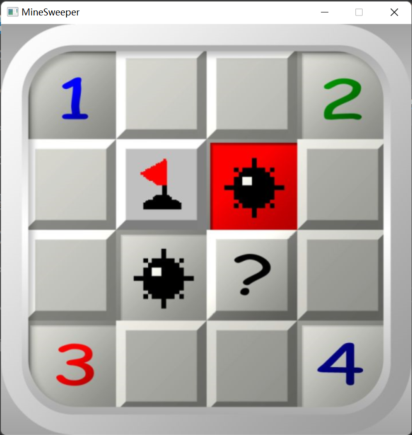
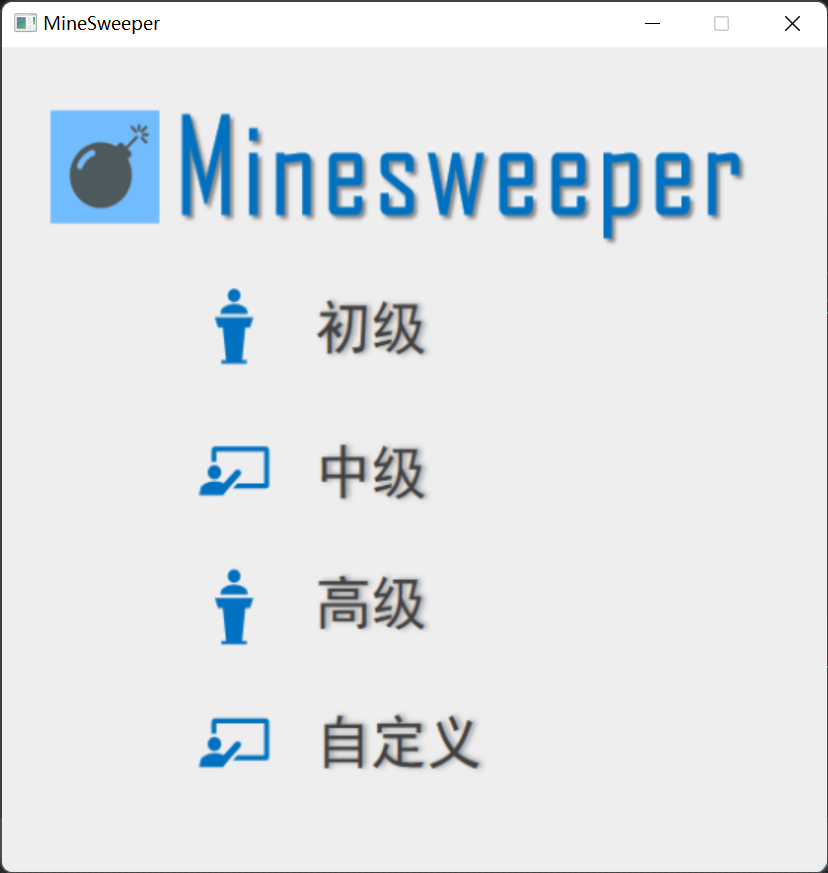
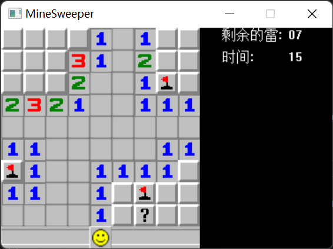
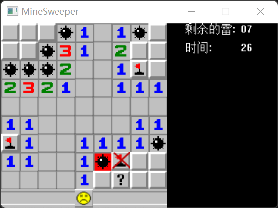
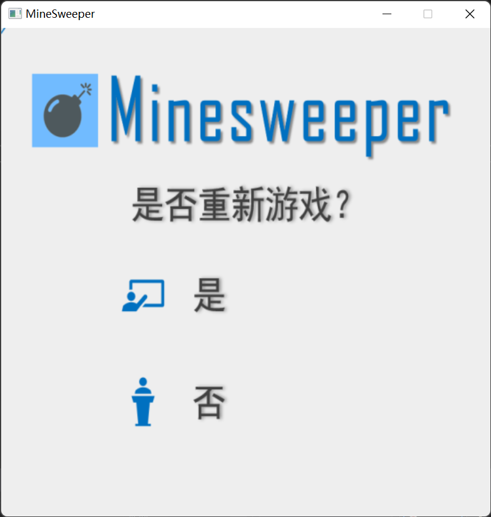
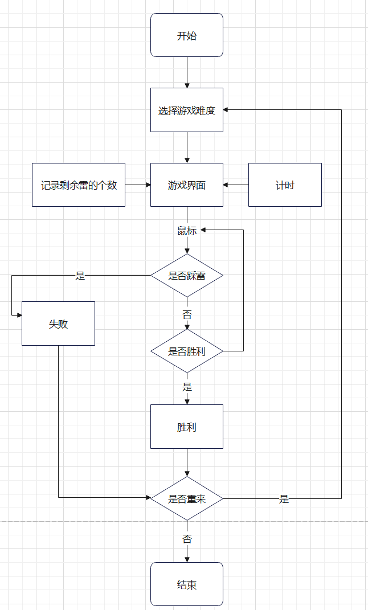
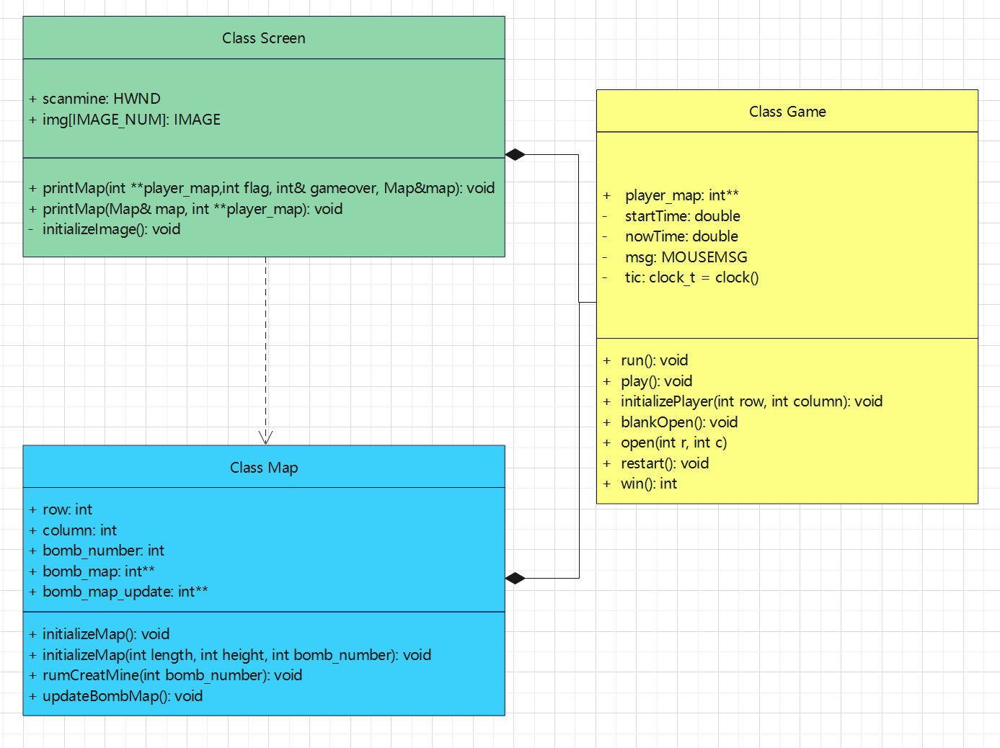
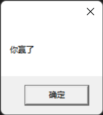
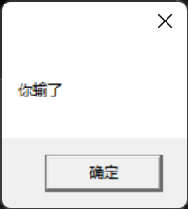
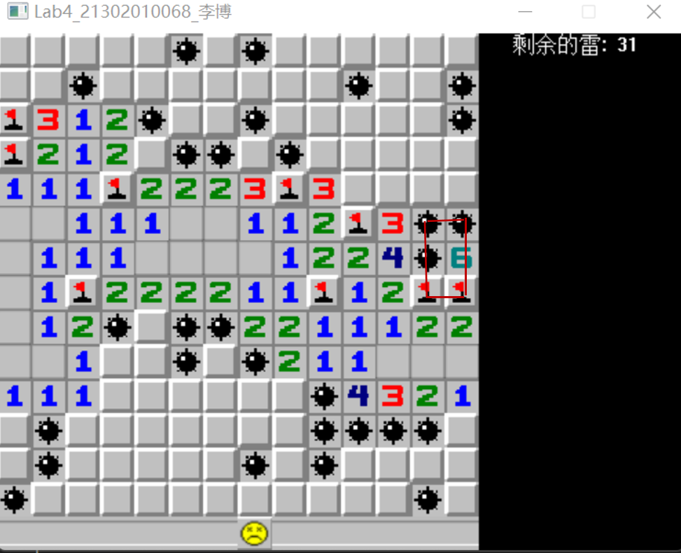

# 扫雷游戏设计文档
# 实验内容
· 完成了基础扫雷功能以及界面设置

· 有低级、中级、高级以及自定义地图大小的选择

· 开局防止第一步点到地雷

· 计时功能以及实时更新剩余地雷数量

· 点击笑脸重新开始本局游戏，以及游戏结束后再来一局功能

· 背景音效，鼠标操作

# 运行展示










# 设计思路与功能描述
## 游戏过程设计

## 类的设计


## Class Game
> Description：
> 用户地图的创建以及游戏操作实现

### Function
```c
	void run();  //游戏开始运行
	void play(); //用户操作 时间刷新
	void initializePlayer(int row, int column); //初始化用户地图
	void blankOpen(int r, int c); //对无地雷格子展开
	void open(int r, int c);      //对已标记地雷九宫格展开
	void restart();              // 游戏结束后重新开始
	int win();                    //判断游戏是否赢
```
### 核心算法
·算法的核心在于对于扫雷中对无地雷格子的展开、已标记地雷九宫格的展开以及用户操作，用户地图的初始化在此不再赘述。

### 无地雷格子展开 void blankOpen(int r, int c)

传入空白格的坐标，对该格子从左上角开始，依次更新九宫格数字到用户数组，如果又遇到空白格，则递归再次展开。

注意的是边界的处理情况，所有在循环九宫格时，需要设定坐标范围在地图之内，防止无限展开越界。

```c
void Game::blankOpen(int r, int c)
{
	for (int i = r - 1; i <= r + 1; i++)
	{
		for (int j = c - 1; j <= c + 1; j++)
		{
			//判断坐标位置，防止无限展开越界；判断有没有排查过；如果是0继续展开
			if (i >= 1 && i < map.row - 1 && j >= 1 && j < map.column - 1 && player_map[i][j] == -1)
			{
				if (map.bomb_map_update[i][j] == 0)
				{
					player_map[i][j] = map.bomb_map_update[i][j];
					blankOpen(i, j);
				}
				else
				{
					player_map[i][j] = map.bomb_map_update[i][j];
				}

			}
		}
	}
}
```

### 左键点击已翻开格子展开 

传入已翻开格子的坐标，统计九宫格内旗子的数量，如果旗子的数量等于中心格子数字，那么九宫格展开，即将九宫格未翻开格子翻开，如果遇到空白格则运行blankOpen()，在此不再赘述。

```c
void Game::open(int r, int c)
{
	int flag = 0;//九宫格旗子数量
	for (int i = r - 1; i <= r + 1; i++)
	{
		for (int j = c - 1; j <= c + 1; j++)
		{
			if (player_map[i][j] == -2)
			{
				flag++;
			}
		}
	}

    //旗子数量等于格子数字，九宫格展开
	if (flag == player_map[r][c])
	{
		for (int i = r - 1; i <= r + 1; i++)
		{
			for (int j = c - 1; j <= c + 1; j++)
			{
				if (player_map[i][j] == -1)
				{
					if (map.bomb_map[i][j] == 1)
					{
						player_map[i][j] = -5;
					}
					//如果是空白格，递归展开
					else if (map.bomb_map_update[i][j] == 0)
					{
						player_map[i][j] = map.bomb_map_update[i][j];
						blankOpen(i, j);
					}
					else
					{
						player_map[i][j] = map.bomb_map_update[i][j];
					}
				}
			}
		}
	}
}
```

### 用户操作、时间刷新

· 用户操作：操作分为左键和右键操作

左键：获取鼠标消息后，通过计算把鼠标点击的像素格坐标转换为数组坐标，在用户数组初始化中，为了方便把每个格子的值赋为-1，根据地雷图对每一次点击对应更改值，若点到地雷则赋值为-5，非地雷则按照对应数字显示,空白格则展开。若点击已展开格子，则回到上一步对已翻开格子展开的叙述，不再赘述。
```c++
if (player_map[r][c] == -1)
{
	if (map.bomb_map[r][c] != 1)
	{
		player_map[r][c] = map.bomb_map_update[r][c];
		if (player_map[r][c] == 0)
		{
			blankOpen(r, c);
		}
		std::cout << player_map[r][c];
	}
	else
	{
		player_map[r][c] = -5;
		screen.printMap(map, player_map);
		MessageBox(screen.scanmine, "你输了", "", MB_OK);
		restart();
	}
}
else if (player_map[r][c] > 0)
{
	open(r, c);
}
```

>特别的，在第一次左键翻开时，若是地雷，则会重新生成一个地雷，把此地雷取消，保证第一次点开不会是地雷。
```c++
//保证第一次不是雷
if (first == true)
{
	first = false;
	startTime = GetTickCount(); //从第一次点击开始计时
	if (map.bomb_map[r][c] == 1)
	{
		map.rumCreatMine(1);
		map.bomb_map[r][c] = 0;
		map.updateBombMap();
	}
}
```

右键：同左键一样转换坐标后，可以对值为-1（即未翻开的格子）的格子标记旗子，赋值为-2，再次右键标记为问号，赋值为-3，右键问号可取消标记即赋值回到-1，同时限制了旗子数量不可以超过地雷数量。

循环操作：用whlie（1）循环实现
>特别的，点击笑脸可以重新刷新本局
```c++
//点击笑脸位置可以刷新本局游戏
if (c == (map.column / 2) && r == map.row - 1)
{
	map.initializeMap(map.column - 2, map.row - 2, map.bomb_number);
	initializePlayer(map.row-2, map.column-2);
	play();
}
```
· 时间刷新：
在第一次点击左键的同时记录一次系统时间，之后每一页面刷新时，就使用当前时间与开始时间作差并输出在对应的位置。

### 判断输赢
点到地雷或者标记错误展开遇到地雷都算游戏失败，游戏赢的条件为所以非地雷格子全部被揭开，选择反向统计，即统计正确标记的旗子数和未揭开格子的数量
>特别的，游戏赢了会有弹窗提示



### 重新开始游戏
游戏结束后可以选择是否重新开始游戏，选择是则回到难度选择的菜单，否则直接退出程序

## Class Map
>Description
>创建地雷图并对九宫格内地雷计数

### Function
```c
	void initializeMap();  //初始化自定义地图
	void initializeMap(int length, int height, int bomb_number); //初始化低中高级地图
	void rumCreatMine(int bomb_number); //随机生成地雷
	void updateBombMap(); //计算九宫格内地雷数
```
### 创建地雷图
根据游戏设计对创建地雷图的函数进行重载，分为已定义大小和自定义大小,在前几个lab的基础上，依然采用new申请动态数组生成地图，随机生成地雷，计算九宫格数字在此不再赘述

## Class Screen
>Description:
将用户地图打印到屏幕，已经游戏失败所有地雷的显示

### Function
```c
	void printMap(int **player_map, int flag, int& gameover, Map& map); //打印用户地图
	void printMap(Map& map, int **player_map); //打印游戏失败的地图
	void initializeImage(); //载入图片素材
```
### 打印地图
分为普通打印用户地图，和游戏失败打印地图，用到数据不同所以对函数进行重载

普通打印：根据Game类中用户的操作对用户数组的更新进行打印,运行效果参考前面运行展示；同时在Game类中为了防止旗子大于地雷数，设置了变量flag，传入这个参数与总雷数作差，在指定位置打印出剩余的雷数。
```c
for (int i = 1; i < map.row - 1; i++)
	{
		for (int j = 1; j < map.column - 1; j++)
		{//贴空白
			if (player_map[i][j] == -1)
			{
				std::cout << " #\t|";
				putimage((j - 1)*SIZE, (i - 1)*SIZE, &img[9]);
			}
			//贴旗子
			else if (player_map[i][j] == -2)
			{
				std::cout << " -2\t|";
				putimage((j - 1)*SIZE, (i - 1)*SIZE, &img[10]);
			}
			//贴问号
			else if (player_map[i][j] == -3)
			{
				std::cout << " -3\t|";
				putimage((j - 1)*SIZE, (i - 1)*SIZE, &img[12]);
			}
			else
			{
				//贴炸雷
				if (map.bomb_map[i][j] == 1 || player_map[i][j] == -5)
				{
					std::cout << " *\t|";
					putimage((j - 1)*SIZE, (i - 1)*SIZE, &img[13]);
					printMap(map, player_map);
					MessageBox(scanmine, "你输了", "", MB_OK);
					gameover = 1;
				}
				//贴数字
				else
				{
					std::cout << player_map[i][j] << " \t|";
					putimage((j - 1)*SIZE, (i - 1)*SIZE, &img[player_map[i][j]]);
				}
			}
		}
		std::cout << "\n";
	}
	std::cout << "---------------\n";
```
游戏失败打印：播放游戏失败音效，游戏失败需要打印出点到的地雷，标记错误的旗子，以及所有的地雷。
```c
PlaySound(TEXT("music/die.wav"), NULL, SND_FILENAME | SND_ASYNC | SND_PURGE);//播放游戏失败音乐
	for (int i = 1; i < map.row - 1; i++)
	{
		for (int j = 1; j < map.column - 1; j++)
		{//贴空白
			if (player_map[i][j] == -1 && map.bomb_map[i][j] != 1)
			{
				std::cout << "#\t|";
				putimage((j - 1)*SIZE, (i - 1)*SIZE, &img[9]);
			}
			//贴地雷
			else if (map.bomb_map[i][j] == 1 && player_map[i][j] == -1)
			{
				std::cout << "*\t|";
				putimage((j - 1)*SIZE, (i - 1)*SIZE, &img[11]);
			}
			//贴旗子
			else if (player_map[i][j] == -2 && map.bomb_map[i][j] == 1)
			{
				std::cout << "-2\t|";
				putimage((j - 1)*SIZE, (i - 1)*SIZE, &img[10]);
			}
			//贴错旗
			else if (player_map[i][j] == -2 && map.bomb_map[i][j] == 0)
			{
				putimage((j - 1)*SIZE, (i - 1)*SIZE, &img[19]);
			}
			//贴问号
			else if (player_map[i][j] == -3)
			{
				std::cout << "-3\t|";
				putimage((j - 1)*SIZE, (i - 1)*SIZE, &img[12]);
			}
			else
			{
				//贴炸雷
				if (player_map[i][j] == -5)
				{
					std::cout << "*\t|";
					putimage((j - 1)*SIZE, (i - 1)*SIZE, &img[13]);
				}
				//贴数字
				else
				{
					std::cout << player_map[i][j] << "\t|";
					putimage((j - 1)*SIZE, (i - 1)*SIZE, &img[player_map[i][j]]);
				}
			}
		}
		std::cout << "\n";
	}
```
>特别的，游戏失败会有弹窗提示


# 项目亮点与不足
## 项目亮点
· 实现了鼠标操作，基本还原了大众熟知的扫雷游戏
· 有音效、弹窗等设计，比起命令行版本有更好的体验感
· 低级、中级、高级、自定义四种选择
· 使用图片素材更加美观真实

## 项目不足
· 计时功能存在缺陷，没有做到真正意义上实时更新
· 本次项目中有一些重复度高的代码，比如在打印普通地图和游戏失败地图时，大部分代码重合，应该考虑对类的设计更加优化。
· 时间问题还有一些想法没有付诸实践：成绩排行榜、存档继续游戏功能、三维立体版扫雷等

# 部分遇到的问题与解决方法
· 绘制窗口函数采用的是先长后宽的方式，但数组采用的是先宽后长的方式，初次写完后试玩发现了奇怪的bug

· 源于自己在过程中行列方向乱用，导致一半数组镜像显示，最后做了统一的修改和规划

# 一些感悟
· 与前三次lab命令行版扫雷不同的是，这次我选择做了图形鼠标交互版的扫雷，尽力让游戏体验更好、更真实。同时，前三次lab是用面向过程的方式写的，并没有类的设计与规划，lab4基本等于我重头书写了一遍。

· 疫情期间封寝，又恰巧遇到电脑总是卡机，每次一调试就卡到程序无响应，最后连浏览器打开都卡到退出。被电脑闹的重启了很多次，想着我为什么要给自己找事写非命令行版，夜里就是一边后悔一边调试。

· 万幸的是，电脑更新了一下，删除c盘一些东西后终于正常了一点。我也慢慢摸到一些门道。最初写的时候，只写了一个类map，然后把所有的函数和变量打包放进去，美其名曰“面向对象”。思考了半天我觉得这不太行，重构的时候对类的设计毫无想法，就在网上搜别人写的代码看（网站很多扫雷代码都是面向过程）。尝试设计了一下类，现在看来还是有很多不足，抽象不够，数据隐藏也不够好，逻辑性也不够强。

· 总而言之，写lab确实是最锻炼人代码能力，为了解决代码bug会去仔细学、提前学一些东西。希望下一次lab能写的更好吧。